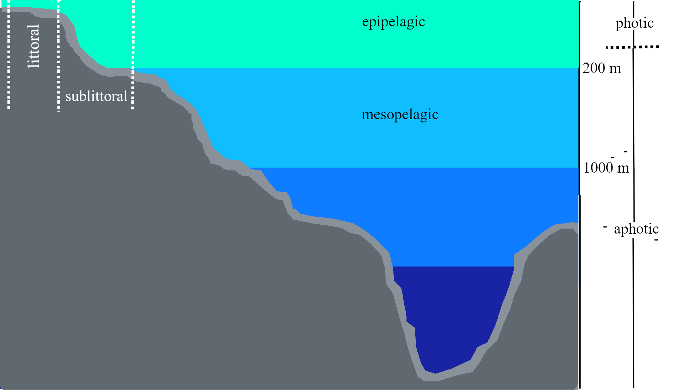

class: title-slide, top, left, inverse
background-image: url(https://pbs.twimg.com/media/D7Km39PXYAA3UGP?format=jpg&name=large)
background-size: cover

# **`r rmarkdown::metadata$title`**
## **`r rmarkdown::metadata$subtitle`**
### `r rmarkdown::metadata$author`
### **`r rmarkdown::metadata$institute`**
### `r Sys.Date()`

```{r setup, include=FALSE}
#load multiple libraries function location
source("C:/Users/Sebbi Kankondi/Desktop/Academic/PhD/Write_Ups/multiple_libraries.R")

# read_library <- function(...) {
#   obj <- eval(substitute(alist(...)))
#   #print(obj)
#   return(invisible(lapply(obj, function(x)library(toString(x), character.only=TRUE))))
# }


read_library(tidyverse, leaflet, sf, xaringanExtra,
             readxl, ggmap, htmltools, knitr)


options(htmltools.dir.version = FALSE)
```

```{r xaringan-tile-view, echo=FALSE}
xaringanExtra::use_tile_view()
```

```{r xaringan-panelset, echo=FALSE}
xaringanExtra::use_panelset()
```

---

name: mfmr

# MFMR

Central institution, governing the .blue[sustainable] utilization of Namibia's .blue[aquatic] resources

???
Consists of 4 different directorates
- Aquaculture and inland fisheries
- Policy, planning and economics 
- Operations
- Resource management

---

template: mfmr

.pull-left[
- Several .itl-orange[offices], .itl-orange[research centers] and .itl-orange[fish farms] throughout the country
]
.pull-right[
```{r out.width='100%', fig.height=6, eval=require('leaflet'), echo=FALSE}
#read in world borders shape file
world_border <- read_sf(paste("C:/Users/Sebbi Kankondi/Desktop/Academic/PhD/Write_Ups",
                              "/MHA_MHU/data/mapshapes",
                              "/world_borders/TM_WORLD_BORDERS-0.3.shp", sep=""))

#read in the MFMR facilities coordinates
#convert multiple variables to numeric or factor
mfmr_coords <- read_excel("data/institute_location.xlsx") %>% 
    mutate_at(c("long","lat"), as.numeric) %>% 
    mutate_at(c("region","town","institute","institute_type"), as.character)  
  # st_as_sf(coords = c("lat","long"), crs = 4326)

#create new label variable for mfmr_coords that contains multiple
#values pasted together

##need to create them as an html tag and then mark them as html so
##that it can be rendered into the map as an html tag
mfmr_coords$label <- paste("<p>", mfmr_coords$institute, "<p/>",
                           "<p>", mfmr_coords$institute_type, "<p/>",
                           "<p>", mfmr_coords$town, "<p/>")


leaflet() %>% 
  addTiles() %>% 
  addProviderTiles(providers$Esri.WorldImagery) %>% 
  setView(18.4940, -22.9576, zoom = 5.45) %>% 
  addPolygons(data = world_border, 
              weight = 1, color="#FFFAFA",
              smoothFactor = 0.5) %>%  ##Change border color and size
  addCircleMarkers(lng = mfmr_coords$long, lat = mfmr_coords$lat,
                   color = "#FF4500", radius = 3, opacity = 1,
                   label = lapply(mfmr_coords$label, HTML)) #tag as HTML

```
]

???
Our physical infrastructure comprises several...

Kifi - Kamutjonga inland fisheries institute

---

template: mfmr

.pull-left[

### Windhoek HQ

- Primary .itl-orange[administrative building]

]

.pull-right[
```{r out.width='100%', fig.height=6, eval=require('leaflet'), echo=FALSE}
leaflet() %>% 
  addTiles() %>% 
  addProviderTiles(providers$Esri.WorldImagery) %>% 
  setView(17.08414, -22.556, zoom = 13.5) %>% 
  addCircleMarkers(lng = mfmr_coords$long, lat = mfmr_coords$lat,
                   color = "#FF4500", radius = 3, opacity = 1,
                   label = lapply(mfmr_coords$label, HTML)) #tag as HTML

```
]

---

name: whk-hq

# Windhoek HQ

Includes offices of the:

---

template: whk-hq

.pull-left[

- Minister
   - Hon. Derek Klazen

]

.pull-right[


]


---

template: whk-hq

.pull-left[

- Minister
   - Hon. Derek Klazen
- Deputy Minister
   - Hon. Sylvia Makgone

]

.pull-right[


]


---

template: whk-hq

.pull-left[

- Minister
   - Hon. Derek Klazen
- Deputy Minister
   - Hon. Sylvia Makgone
- Executive Director
   - Ms. Annely Haiphene

]

.pull-right[


]


---

template: mfmr

.pull-left[

### NatMIRC

- Primary .itl-orange[research center]

]
.pull-right[
```{r out.width='100%', fig.height=6, eval=require('leaflet'), echo=FALSE}
leaflet() %>% 
  addTiles() %>% 
  addProviderTiles(providers$Esri.WorldImagery) %>% 
  setView(14.52294, -22.6854, zoom = 14) %>% 
  addCircleMarkers(lng = mfmr_coords$long, lat = mfmr_coords$lat,
                   color = "#FF4500", radius = 3, opacity = 1,
                   label = lapply(mfmr_coords$label, HTML)) #tag as HTML

```
]

???
Like I mentioned earlier, the focus of this presentation is NatMIRC ...
National Marine Information and Research Center

---

template: mfmr

.pull-left[

### NatMIRC

- Primary .itl-orange[research center]
- Some administrative functions.

]
.pull-right[
 
<!-- style="transform: rotate(90deg);"/> -->

.caption[
NatMIRC main entrance.
]
]

---

template: mfmr

.pull-left[

### NatMIRC

- Primary .itl-orange[research center]
- Some administrative functions.
- Predominantly .itl-orange[research biologists] and .itl-orange[technical staff]

]
.pull-right[
 
<!-- style="transform: rotate(90deg);"/> -->
.caption[
MFMR technical assistants sampling in  the rocky intertidal near Henties Bay
]
]

???
technical staff members who assist the biologists with their daily objectives

---

template: mfmr

.pull-left[

### NatMIRC

- Primary .itl-orange[research center]
- Some administrative functions.
- Predominantly .itl-orange[research biologists] and .itl-orange[technical staff]
- Split into .itl-orange[4] smaller .itl-orange[subdivisions]
   - Pelagic
   - Demersal
   - Environment
   - Mariculture


]
.pull-right[
 
<!-- style="transform: rotate(90deg);"/> -->
.caption[
NatMIRC staff offices for the different research sections.
]
]

???

Essentially

---

name: natmirc

background-image: url("images/ocean_levels_full.png")
background-position: bottom
background-size: contain

# NatMIRC

.itl-orange[**4 Main sections** - names defined by research area/oceanic zone research is based on.]

???
these names associate these sections with the ocean zone/region their research is based on, albeit very loosely. Now before I elaborate I'd like to quickly go over what you see in this graphic infront of you.

The main focus of this graphic is the oceanic zones (epi, meso, bathy, abyssal)
We can distinguish between these zones based primarily on the amount of meaningful sunlight they receive.
epipelagic zone - receives enough sunlight for photosynthesis and is highly productive
mesopelagic - experiences a dramatic decrease in sunlight and limited photosynthetic activity
bathypelagic and abyssalpelagic zones - receive no sunlight at all, experience no sunlight derived primary activity, deepest zone, extreme pressure, and there is a severe lack of food in both zones

Littoral/intertidal sediment zone - coastal zone where tide fluctuates between low and high, substratum exposed to air during low tide and submerged during high tide.

Sublittoral/subtidal sediment zone - Immediately after littoral zone toward sea, continually submerged (5m - 200m beneath the sea surface)

Benthic - which refers to the bottom sediment of the ocean, irrespective of oceanic zone


Examples of animals in bathypelagic:
Lantern fish - small, luminescent; Vampire squid - invert webbed arms and cloak bodies

Examples of animals in abyssalpelagic:
Deep-sea angler fish - modified dorsal fin with bioluminescent tip to lure prey;
Fangtooth fish - large teeth, disproportionately large head size


---

template: natmirc

background-image: url("")
background-position: bottom
background-size: contain

.left-column[

- .itl-orange[Pelagic]
   - Open ocean and coastal water column.

]

.right-column[


]

---

template: natmirc

background-image: url("")
background-position: bottom
background-size: contain


.left-column[

- .itl-orange[Demersal]
   - Part of the water column directly above the Benthic layer
      
      
]

.right-column[


]

???

Demersal
- Benthic/Benthos denotes areas on top of/within the sediment layer.


---

template: natmirc

background-image: url("")
background-position: bottom
background-size: contain


.left-column[

- .itl-orange[Environment]
   - Works in the tidal zone and the open ocean.


]

.right-column[


]

???
Environment
- Tidal zone includes the Littorina, intertidal and subtidal zones.


---

template: natmirc

background-image: url("")
background-position: bottom
background-size: contain


.left-column[

- .itl-orange[Mariculture]
   - Mainly shellfish and some seaweed culture (farming) within coastal waters.

]

.right-column[


]

???
mariculture is the culture/farming of marine organisms such as shellfish and seaweed

---

name: pelagic

background-image: url("images/seals.gif")
background-size: cover


# Pelagic

.warmyellow[
**Assess state of commercially valuable pelagic resources...**
]

???
Primary function of the pelagic division

e.g., spp include
--

background-image: url("")
background-size: cover

.panelset[
.panel[.panel-name[Cape fur seals]
.pull-left[

.caption[
*Arctocephalus pusillus pusillus*
]
]
.pull-right[
- One of two *Arctocephalus pusillus* subspecies.
- Distribution generally restricted to Southern African shorelines.
]
]


.panel[.panel-name[Horse mackerel]

.pull-left[

.caption[
*Trachurus trachurus*
]
]
.pull-right[
- Most abundant pelagic spp in Namibian EEZ.
- Mid water seine fisheries.
]
]


.panel[.panel-name[Bigeye tuna]
.pull-left[

.caption[
*Thunnus obesus*
]
]
.pull-right[
- Large pelagic spp (2.5m; 180kg).
- Surface and subsurface waters (200-500m).
- Blood with high affinity for O<sup>2</sup>, adaptation to water with low O<sup>2</sup> concentrations (< 1.2 mL/L)
- Long line fisheries
]
]
]

???

The other Cape fur seal subspecies is *Arctocephalus pusillus doriferus*. Visual differences: *A.p.p* larger, lighter fur, reddish brown back. *A.p.d* distinct V shaped mark on chest. Audio *A.p.p* higher pitched, nasal; *A.p.d* deeper, throaty. 
Some seals found > 200km off shore.

Mid water seine: large cone shaped net, wide open mouth and closed off rear, fit with floats to keep it at mid water. Net towed behind fishing vessels.

Normal seawater oxygen concentration = 5-8 mL/L
Set lines with several hooks, retrieved after some time. Purse seine less common.

---

template: pelagic

background-image: url("")
background-size: cover

by employing .itl-orange[monitoring] and .itl-orange[research programs] i.e.,

.panelset[
.panel[.panel-name[Hydro-acoustics]
.pull-left[

.caption[
Echosounder
]
]
.pull-right[

- Application of sound in water, specifically sonar.
- Detect and survey small pelagic spp i.e., Sardines and Horse mackerel in the open ocean.
- Estimate abundance, distribution and spp composition.

]
]

.panel[.panel-name[Interviews]
.pull-left[

.caption[
Angler found along the coast
]
]
.pull-right[

- Angler catch statistics can be generated through concerted interview efforts.
- Number and type of fish caught, as well as size.

]
]

.panel[.panel-name[Aerial surveys]
.pull-left[

.caption[
Aerial photograph
]
]
.pull-right[

- Abundance surveys can be conducted with the help of various low flying aircraft/drones.
- Within spp counts generated using systematic photographic methods.
- Applicable to amphibious marine animals e.g., Penguins and Seals.

]
]
]

???
The methods used to monitor and assess pelagic resources include 

Echosounder: emits sound waves that bounces off objects in underwater environment which is then retrieved and displays as an echogram using specialized software. The data is then analyzed using data analysis software e.g., R, Matlab

Aerial: We currently hire an aircraft from a company called Bush skies aviation. The camera has to be mounted to bottom of aircraft on a gyro-stabilized platform. This ensures the camera operator can take clear pictures that are in focus, remotely from inside the aircraft using a control panel.

This gives us an idea of the abundance, distribution and composition of our pelagic resources

---

name: demersal

background-image: url("images/lobster_diving.png")
background-size: cover


# Demersal

.itl-orange[
**Monitor commercially valuable demersal resources...**
]

???
Our demersal resources include fish spp hake or M.paradoxus 

--

background-image: url("")
background-size: cover


.panelset[
.panel[.panel-name[Hake]

.pull-left[

.caption[
*Merluccius paradoxus*
]
]
.pull-right[
- Deep water hake spp.
- Found at depths of 200-850m below the sea surface.
- Thought to be less abundant than its shallow water counterpart *M.capensis*.
]
]


.panel[.panel-name[Orange roughy]

.pull-left[

.caption[
*Hoplostethus atlanticus*
]
]
.pull-right[
- Found at depths 180-1800m below the sea water surface.
- Lives for up to 250 years long.
- Bottom trawling

]
]


.panel[.panel-name[Deep sea red crab]

.pull-left[

.caption[
*Chaceon quinquedens*
]
]
.pull-right[
- Found at depths > 400m beneath the sea surface.
   - Males found at greater depths than females.
- Approx. 17.5 cm in size (at widest point across the carapace).
]
]
]


???

Hake
- *M.p* is also larger than *M.c*. Another way to distinguish between the two is darker, reddish brown colour of  *M.p*, compared to *M.c* that is silver, grey

- A really interesting fact about the Orange roughy...
- this animal is caught by bottom trawling, which I will explain in a moment.

- Carapace is the top part of the crabs shell

Roughy & Crabs
- Bottom trawl

---

template: demersal

background-image: url("")
background-size: cover

Various .itl-orange[monitoring] and .itl-orange[research programs] i.e.,


.panelset[
.panel[.panel-name[Trawling]

.pull-left[

.caption[
Swept area trawling
]
]
.pull-right[
- Spp include Monk and Hake.
- Conical net with wide mouth at its entrance and closed off narrow tail/cod end where fish are trapped
- Net sweeps sea bed over wide area.

]
]


.panel[.panel-name[Traps]

.pull-left[

.caption[
"Crayfish traps"
]
]
.pull-right[
- Some lobster habitats inaccessible to trawl surveys e.g., between cobbles/boulders.
- Baited traps lowered down to ocean floor
- Hauled up after set amount of time (days/weeks)
- Sizing and data recording activities completed on shore
]
]
]

???

Examples of sample methods used to assess our demersal resources include trawling and laying traps


Like mid water seine fishing, the nets are conical....

Swept area trawling
- image is a multi rig setup
- Floats attached to the top help keep it open (also use Otter boards)
- Provides an index of abundance, which can then be converted into an absolute measure of biomass.

Lobster surveys
- Post-larvae lobsters actively select these shelter providing microhabitats. - traps left on floor for some time
- Traps have elevated funnel shaped entrance, just large enough for large lobsters
- Once inside cage, lobsters find it difficult to find their way back out.

   
Crab surveys
- On shore activities conducted within appropriately equipped facilities.
- Crab lured into the cage with the bait.
- The trap door lets them into the cage but, does not let them back out. 

---


name: environment

background-image: url("images/aqua.png")
background-size: cover


# Environment

.itl-orange[
**Various biological, chemical and physical oceanographic/climatic parameters.**
]

???
The environment division monitors various, physical, chemical and biological oceanographic processes, which includes

--

background-image: url("")
background-size: cover


.panelset[
.panel[.panel-name[SST]

.center[

]
]


.panel[.panel-name[Chl-a]

.center[


]
]


.panel[.panel-name[Benguela]

.left-column[
- Both oceanographic variables heavily influenced by the .itl-orange[Benguela current]
- 1 of 4 .itl-orange[Eastern Boundary Upwelling Systems]
]
.right-column[

]
]


.panel[.panel-name[Upwelling]

.left-column[
- Warm surface waters replaced by cool, nutrient rich bottom waters
]
.right-column[

]
]


.panel[.panel-name[Productive]

.left-column[
- Increase in primary productivity
- Subsequent increase in marine fauna abundances
]
.right-column[

]
]

]

???
sst and chl-a: describe legend and contrast West vs East
Chl-a indication of primary production

Both of the previously oceanographic parameters are heavily...

EBUS - eastern side of major ocean basin e.g., atlantic and pacific

Upwelling: South easterly winds + ocean currents blow warm surface waters 
offshore. Allowing cold, nutrient rich water from the northward flowing benguela current to rise up in the water column. Where the increased nutrients 
can support increased primary production through phytoplankton in surface waters.
In turn supports larger fauna abundances along west coast. 


---

template: environment

background-image: url("")
background-size: cover

Monitored using...

.panelset[
.panel[.panel-name[CTD sensor]

.pull-left[

<!-- style="transform: rotate(270deg);" /> -->

.caption[
CTD sensor lowered on winch
]
]
.pull-right[
- Combined Conductivity, Temperature and Depth (CTD) sensor
- CTD frame lowered into ocean using a crane/winch
- Records vital physical and chemical oceanographic properties in near real time.
- Used to identify vertical ocean profiles 
   - how physical properties change with depth.
] 
]

.panel[.panel-name[ADCP instrument]

.pull-left[

.caption[
Acoustic Doppler Current Profiler
]
]
.pull-right[
- Sensor mounted on metal/plastic frame. 
- Current direction and velocity.
- Sound waves bounce off currents
- Generate an understanding of current profile
   - e.g., eddies, fronts and boundary currents
]
]

.panel[.panel-name[Research vessel]

.pull-left[

.caption[
RV mirabilis
]
]
.pull-right[
- Both CTD and ADCP usually deployed from research vessels.
]
]


.panel[.panel-name[Aqua Satellite]

.pull-left[

.caption[
NASA's Aqua satellite
]
]
.pull-right[
- MODIS (Moderate Resolution Imaging Spectroradiometer) is used for earth surface and low atmosphere climatic measurements.
- MODIS was fit to the Aqua and Terra satellites by Santa Barbara Remote sensing in conjunction with NASA in the early 1990s.
]
]

]


???
CTD: Programmable sensors mounted within larger device called CTD rosette. Includes set of 
weights/floats and water sampling bottles. Also records DO2.

ADCP: Sensors used across various ocean depths using sound wave technology.
Eddies: Swirling circular currents, caused by interaction of ocean currents with seafloor topography/wind.
Fronts: Boundaries between water masses with different physical properties, caused by interaction of ocean currents with mixing of different water masses.
boundary currents: ocean currents that flow along edge of a continent or ocean basin e.g., agulhus current on east coast of SA.
Dopplers: class of sensors with that emit frequencies used to detect moving objects.


SST and CHL-A: Data used to generate these maps obtained from MUR (Multi-scale Ultra High Resolution) dataset. Generated from combination of various different datasets.
Spectroradiometers normally record the spectral distribution of light with applications in characterizing colour that is then used to generate values used to compile sst datasets.

---


name: mariculture

background-image: url("images/abalone_tanks.png")
background-size: cover

# Mariculture

.warmyellow[
**"Aquaculture" of several marine plant and animal spp.**
]

--

background-image: url("")
background-size: cover


- Nine farms along the coast 
   - e.g., Walvis Bay - Swakopmund, Luderitz and Oranjemund
- All privately owned.
- Production focused on...

???
Aquaculture - actively involved in fingerling and feed production (3 spotted tilapia and catfish).

What is Mariculture
- Specialized branch of aquaculture, involving the cultivation of marine organisms for food and other products.


---

template: mariculture

background-image: url("")
background-size: cover

.panelset[
.panel[.panel-name[Oyster]

.pull-left[

.caption[
*Crassostrea gigas* processing facility
]
]
.pull-right[
- Pacific oyster
- Only organism produced under direct guidance of MFMR.
- Max size 15 - 20 cm
- Exhibit sequential hermaphroditism
   - Can change from male to female and vice versa
]
]


.panel[.panel-name[Abalone]

.pull-left[

.caption[
*Heliotis midae* samples
]
]
.pull-right[
- Perlemoen
- Max size 12 - 20 cm in length.
- Most valuable culture resource per kg.
- Produced by the hake processing company, Hangana Seafood, in Namibia
]
]


.panel[.panel-name[Seaweed]

.pull-left[

.caption[
*Macrocystis pyrifera*
]
]
.pull-right[
- Giant kelp
- Not a plant, it's a heterokont
   - A group of protists/algae
- Grows to 30m.
- Cultivated by Kelp Blue in Namibia.
- Dominant culture product = alginate.
   - Ingredient in pharmaceutical and agricultural industry.
]
]
]

???

Oysters
- Change from male to female or vice versa.
- Protandrous 
   - From male to female
- Protogynous
   - From female to male.
- Trait shown in many other aquatic invertebrates

Abalone
- Both its flesh and its shells are sold globally.

Giant kelp
- Also called bladder kelp.
- Picture includes bulbs at base of fronds called pneumatocysts.
   - Helps plant remain suspended in sea water to absorb sunlight
- Attaches to rocks through a structure called a holdfast.
- Protists are organisms that contain a cell nucleus that is not an animal, plant or fungus
- Obtains its nutrients directly from the water and not through roots.
- Unicellular without cellulose cell wall.

---

template: mariculture

background-image: url("")
background-size: cover

using several .itl-orange[culture techniques] e.g.,


.panelset[
.panel[.panel-name[Long-line]

.pull-left[

.caption[
*C.gigas* culture using long lines
]
]
.pull-right[
- Juvenile organisms are fixed to longlines left to hang in the water.
- Longlines hung from main lines connected to "spreader bars" and floats for buoyancy.
- Other example spp include *Mytilus galloprovincialis* and *Ostrea edulis*.

]
]


.panel[.panel-name[Onshore cultivation]

.pull-left[

.caption[
Onshore *H.midae* aquaculture facility in Luderitz
]
]
.pull-right[
- Abalone farmed on-shore in tanks.
- Seawater recirculated between the facility and the sea.
- Feed consists mainly of kelp.

]
]
]

???
Longline: 
Oyster bred through hatchery production systems that consist of tanks on-shore, once certain age/size removed from hatchery and fixed to lines. Age determined through growth ring analysis of their shells under a microscope, called the shell growth increment method (approximation).
Common names - mediterranean mussel and European flat oyster

tanks:
Abalone normally found in subtidal waters (2-15m) on rocky surfaces, in crevices or in cliff overhangs. Ontogenetic vertical distribution across shore (Juveniles on higher shore zones).


---

name: natmirc2

background-image: url("")
background-size: cover

# NatMIRC

.itl-orange[**4 Main sections** - names defined by research area]/.blue[oceanic zone] .itl-orange[research is based on].

.itl-orange[Research objectives] help .warmyellow[set and assess] .itl-orange[marine resource management and conservation] strategies for Namibian EEZ 


---

# Research Objectives

.itl-orange[**4 Main sections** - names defined by research area]/.blue[oceanic zone] .itl-orange[research is based on].

.itl-orange[Research objectives] help .warmyellow[set and assess] .itl-orange[marine resource management and conservation] strategies for Namibian EEZ 

.pull-left[
- Pelagic & Demersal
   - .itl-orange[Compilation of reports] on .itl-orange[population level parameters] e.g., spp abundance, size composition, spatial distribution.  
]

--


.pull-right[
- Environment
   - relating .itl-orange[biological trends] to .itl-orange[oceanographic processes].
   - Help determine .itl-orange[predictive cues] for fisheries population level events.
]

--

.pull-left[
- Mariculture
   - Help mariculturists develop and improve operations.    
   - Provide extension services.
   - Alleviate anthropogenic pressure on fisheries sector.
]

???

EEZ
- Exclusive Economic Zone

Overall the objective is to generate a knowledge pipeline from research and reports, to the Marine Resources Advisory Council, who are responsible for ensuring relevant Executive Management members obtain this information and are appropriately advised on a suitable course of action, related again, to the sustainable management of our marine resources.   

---

name: natmirc2

background-image: url("")
background-size: cover

# NatMIRC

.itl-orange[**4 Main sections** - names defined by research area]/.blue[oceanic zone] .itl-orange[research is based on].

.itl-orange[Research objectives] set by the .itl-orange[Marine Resources Act (MRA) 27]

---

name: natmirc2

background-image: url("")
background-size: cover

# MRA 27 of 2000

.itl-orange[**4 Main sections** - names defined by research area]/.blue[oceanic zone] .itl-orange[research is based on].

.itl-orange[Research objectives] set by the .itl-orange[Marine Resources Act (MRA) 27]


- Principal MFMR governing regulations defined in 2000  

???

Examples of other documents that contribute to our legal framework include:
Marine Resource Policy, Aquaculture act and Aquaculture policy
- determine Aquaculture best practices and regulations.


--


- Guidelines for .itl-orange[fisheries conservation] efforts
   - Through establishment of protected areas and regulation of fishing practices.
   - Ensure long term sustainability of fish stocks.
      - e.g catch limits, permits, closed season.
   - Measures required to enforce resource use regulations
   
???


---

name: natmirc2

background-image: url("")
background-size: cover

# Fisheries management & Conservation

.itl-orange[**4 Main sections** - names defined by research area]/.blue[oceanic zone] .itl-orange[research is based on].

.itl-orange[Research objectives] help .warmyellow[set and assess] .itl-orange[marine resource management and conservation] strategies for Namibian EEZ 

Main enforcement agency, the .itl-orange[Directorate of Operations], Walvis Bay.


.panelset[
.panel[.panel-name[Patrols]

.pull-left[

.caption[
Anna Kakurukaze Mungunda patrol vessel
]
]
.pull-right[
- Conduct oceanic surveillance
- Aid with annual surveys
]
]


.panel[.panel-name[Inspectors]

.pull-left[

.caption[
Inspectors on-board a fishing vessel
]
]
.pull-right[
- Monitor and enforce fisheries legislation at landing sites and on fishing vessels
- Collect accurate landing data 
]
]

.panel[.panel-name[Landings]

.pull-left[

.caption[
Landings data generated by inspectorate
]
]
.pull-right[
- Number of individual fish caught per spp, as counted at ports/landing sites
- Indication of fish stock status.
]
]


]

???

Penalties for any individual, vessel or company found to be in contravention of the laws and regulations governing Namibia's EEZ, depend on the nature/severity of the offence committed. These include fines, license suspension or revocation and in extreme cases the seizure of vessels or imprisonment.
These penalties are designed to be commensurate with the offence committed.

---

name: landings

# Landings

```{r echo=FALSE}
knitr::include_url("C:/Users/Sebbi Kankondi/Documents/National Marine Aquarium/ministry_presentations/images/mfmr_landings.html")

```

???
Illustrate graph interactivity by focusing on horse mackerel and hake.

Several factors contributing to declining fish stocks
Primary suspect is overfishing: fishing efforts exceed ability of fish stock to replenish themselves.
There is also illegal, unreported, unregulated fishing (IUU): illegal fishing practices include fishing without permits, using prohibited fishing gear and fishing in restricted areas.
Destruction of habitats/habitat loss via climate change: the loss of important breeding sites i.e., reefs, kelp forests, etc. Or a change in ocean chemistry through the process of ocean acidification (increase in its pH) and an increase in temperature which can cause major fish die offs.
inadequate or ineffective management practices: These include weak regulations, a lack of enforcement of those regulations or poor monitoring systems, all of which can contribut to unsustainable fishing practices.


---

name: natmirc2

background-image: url("")
background-size: cover

# Fisheries management & Conservation

.itl-orange[**4 Main sections** - names defined by research area]/.blue[oceanic zone] .itl-orange[research is based on].

.itl-orange[Research objectives] help .warmyellow[set and assess] .itl-orange[marine resource management and conservation] strategies for Namibian EEZ 

Main .itl-orange[regulatory parameters] include...


.panelset[
.panel[.panel-name[MSY]

.pull-left[

.caption[
Maximum sustainable yield
]
]
.pull-right[
- Highest possible annual catch that can be sustained while attaining stock levels that yield maximum growth
- Based on variety of factors
   - spp life history, reproductive rates, and health of population.
- Population model used to estimate target spp population size and growth vs time.
   
]
]


.panel[.panel-name[TAC]

.pull-left[

.caption[
Total Allowable Catch
]
]
.pull-right[
- Max quantity of fish/spp made available for recreational, subsistence or commercial fishing over predetermined period of time
- Enforced through the allocation and inspection of rights/quotas
]
]


]

???

Information from landings data help MFMR determine overarching regulatory parameters i.e., MSY and TAC

MSY: Population model accounts for factors such as the birth and death rates,  amount of fishing pressure on the population, and the level of natural mortality due to predation or disease.
Once generated, the population model can be used to calculate MSY, this is done by simulating different levels of fishing pressure on the population and then identifying the level at which the population is able to maintain a stable level of abundance.


TAC: Determined through a process of stock assessment and consultation with all relevant stakeholders, and is intended to ensure the long-term sustainability of the fisheries resources. Stock assessment involves collecting and analyzing data on fish abundance, distribution, growth, reproductive and mortality rates. Which is used to determine the size and health of population and its ability to sustainably support harvest. After stock assessment continue with consultation process with stakeholders (fishing communities, fishermen, scientists and government officials). Stakeholders give input on range of factors such as the social and economic impacts of the fishery, sustainability of the current fishing practices and the effectiveness of the management measures.
TAC set to maintain a balance between the needs of the fishing industry and the long term health of the fish population. Once set it is divided among individual fishermen or fishing companies as individual fishing quotas (IFQ) or other types of catch limits.


---

name: aquarium

background-image: url("images/aquarium.png")
background-size: cover

# What about the Aquarium??


--

background-image: url("")
background-size: cover

.blue[**National Marine Aquarium**]

.panelset[
.panel[.panel-name[Marine aquarium]

.pull-left[

.caption[
Front entrance
]
]
.pull-right[
- Smallest NatMIRC division.
- Only facility of its kind in Namibia.
- Main vessel for education on marine systems at NatMIRC.
]
]

.panel[.panel-name[Marine life display]

.pull-left[

.caption[
Main display tunnel
]
]
.pull-right[
- 320 000L of water.
- Showcase marine life found in Namibian waters.
   - e.g., Dusky kob, Gully shark, Green sea turtle.     
- Only animals found in Namibian waters. 
]
]


.panel[.panel-name[Education]

.pull-left[

.caption[
Floor tour group
]
]
.pull-right[
- Various activities.
   - floor tours around the facilities.
   - presentations in the auditorium.
   - live feeding displays.
- Spread awareness of Namibian marine life among general public.
- Conservation function???
]
]


]

???

Can also be  directly involved in conservation efforts, by acting as a sanctuary for marine life who's well being is under immediate danger. e.g., Injured Green sea turtle that was brought to the aquarium. But conservation efforts mainly facilitated through educating the general public on the importance of the marine ecosystem to our own continued survival.


---

class: inverse, center, middle

# Acknowledgements

Thank you to my colleagues:

- Lessyn Kalwenya
- Richard Horaeb
- Moses Kalola
- Foibe Nghoongoloka
- Frikkie Botes


Help sourcing pictures, obtaining relevant data and general advice.

---

class: inverse, center, middle

# Questions???


