class: title-slide, top, left, inverse
background-image: url(https://pbs.twimg.com/media/D7Km39PXYAA3UGP?format=jpg&name=large)
background-size: cover

# ****
## ****
### 
### ****
### 2023-01-21


---

name: mfmr

# MFMR

Central institution, governing the sustainable utilization of Namibia's aquatic resources

---

template: mfmr

.pull-left[
- Consists of several .itl-orange[offices], .itl-orange[research centers] and .itl-orange[fish farms] throughout the country
]
.pull-right[

```
## PhantomJS not found. You can install it with webshot::install_phantomjs(). If it is installed, please make sure the phantomjs executable can be found via the PATH variable.
## PhantomJS not found. You can install it with webshot::install_phantomjs(). If it is installed, please make sure the phantomjs executable can be found via the PATH variable.
```

```
## Error in path.expand(path): invalid 'path' argument
```
]

???

Need exact coordinates, names, names of towns (or closest towns) of all MFMR offices, research facilities and farms.

---

template: mfmr

.pull-left[

### Windhoek HQ

- Primary .itl-orange[administrative offices]

]

.pull-right[

```
## PhantomJS not found. You can install it with webshot::install_phantomjs(). If it is installed, please make sure the phantomjs executable can be found via the PATH variable.
```

```
## Error in path.expand(path): invalid 'path' argument
```
]

???


---

name: whk-hq

# Windhoek HQ

Including offices of the:

---

template: whk-hq

.pull-left[

- Minister
   - Hon. Derek Klazen

]

.pull-right[


]


---

template: whk-hq

.pull-left[

- Minister
   - Hon. Derek Klazen
- Deputy Minister
   - Hon. Sylvia Makgone

]

.pull-right[


]


---

template: whk-hq

.pull-left[

- Minister
   - Hon. Derek Klazen
- Deputy Minister
   - Hon. Sylvia Makgone
- Executive Director
   - Ms. Annely Haiphene

]

.pull-right[


]


---

template: mfmr

.pull-left[

### NatMIRC

- Primary .itl-orange[research center]

]
.pull-right[

```
## PhantomJS not found. You can install it with webshot::install_phantomjs(). If it is installed, please make sure the phantomjs executable can be found via the PATH variable.
```

```
## Error in path.expand(path): invalid 'path' argument
```
]

---

template: mfmr

.pull-left[

### NatMIRC

- Primary .itl-orange[research center]
- Some administrative functions.

]
.pull-right[
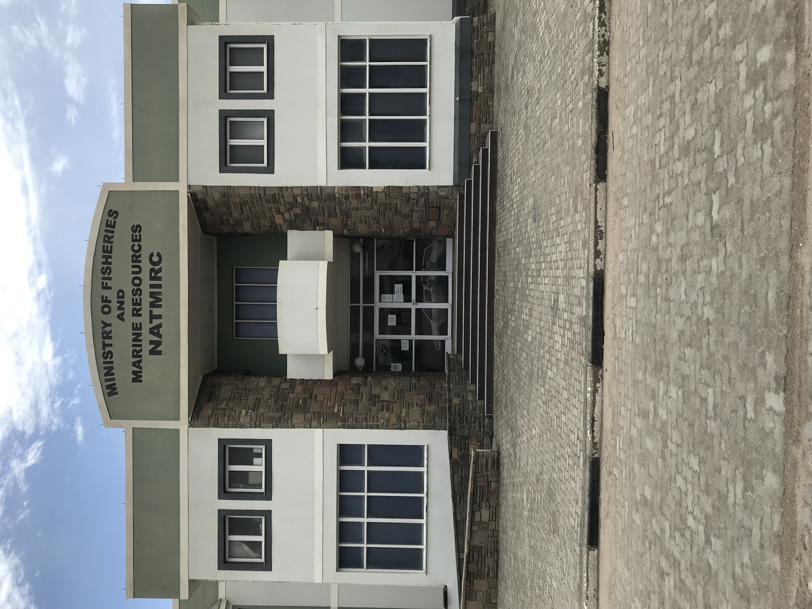
.caption[
NatMIRC main entrance.
]
]

---

template: mfmr

.pull-left[

### NatMIRC

- Primary .itl-orange[research center]
- Some administrative functions.
- Predominantly .itl-orange[research biologists] and .itl-orange[technical staff]

]
.pull-right[

.caption[
MFMR technical assistants sampling in  the rocky intertidal near Henties Bay
]
]

---

template: mfmr

.pull-left[

### NatMIRC

- Primary .itl-orange[research center]
- Some administrative functions.
- Predominantly .itl-orange[research biologists] and .itl-orange[technical staff]
- Split into .itl-orange[4 main sections]


]
.pull-right[
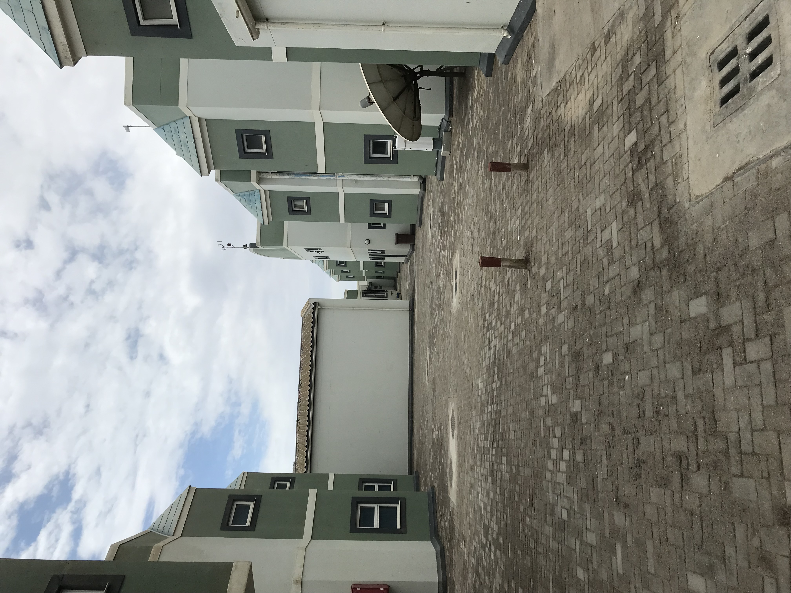
.caption[
NatMIRC staff offices for the different research sections.
]
]

---

name: natmirc

background-image: url("images/ocean_levels_full.png")
background-position: bottom
background-size: contain

# NatMIRC

.itl-orange[**4 Main sections** - names defined by research area/oceanic zone research is based in.]

---

template: natmirc

background-image: url("")
background-position: bottom
background-size: contain

.left-column[

- .itl-orange[Pelagic]
   - Open ocean and coastal water column.

]

.right-column[


]

---

template: natmirc

background-image: url("")
background-position: bottom
background-size: contain


.left-column[

- .itl-orange[Demersal]
   - Part of the water column directly above the Benthic layer
      
      
]

.right-column[


]

???

Demersal
- Benthic/Benthos denotes areas on top of/within the sediment layer.


---

template: natmirc

background-image: url("")
background-position: bottom
background-size: contain


.left-column[

- .itl-orange[Environment]
   - Works in the tidal zone and the open ocean.


]

.right-column[


]

???
Environment
- Tidal zone includes the Littorina, intertidal and subtidal zones.


---

template: natmirc

background-image: url("")
background-position: bottom
background-size: contain


.left-column[

- .itl-orange[Mariculture]
   - Mainly shellfish and some seaweed culture (farming) within coastal waters.

]

.right-column[

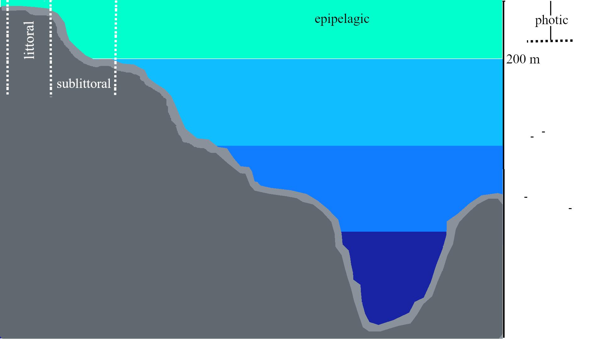
]


---

name: pelagic

background-image: url("images/seals.gif")
background-size: cover


# Pelagic

.itl-orange[
**Assess state of commercially valuable pelagic resources...**
]

--

background-image: url("")
background-size: cover

.panelset[
.panel[.panel-name[Cape fur seals]
.pull-left[

.caption[
*Arctocephalus pusillus pusillus*
]
]
.pull-right[
- One of two *Arctocephalus pusillus* subspecies.
- Distribution generally restricted to Southern African shorelines.
]
]


.panel[.panel-name[Horse mackerel]

.pull-left[
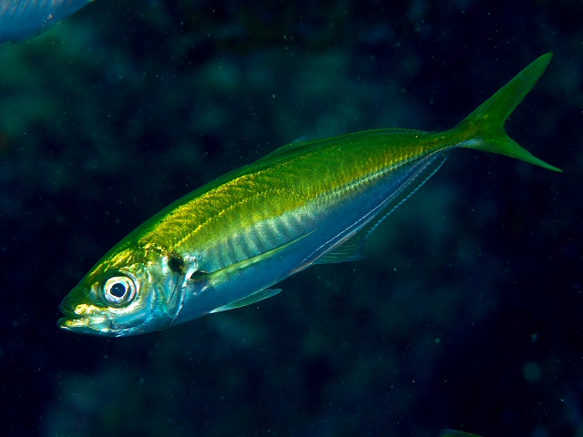
.caption[
*Trachurus trachurus*
]
]
.pull-right[
- Most abundant pelagic spp in Namibian EEZ.
- Mid water seine fisheries.
]
]


.panel[.panel-name[Bluefin tuna]
.pull-left[
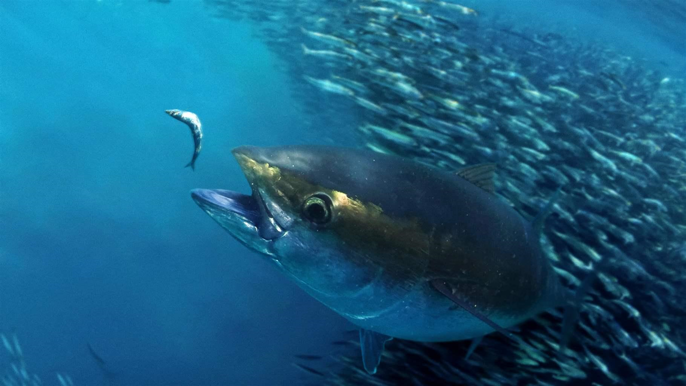
.caption[
*Thunnus thynnus*
]
]
.pull-right[
- Large pelagic spp, largest (3m; 600kg) of all Tuna.
- Surface and subsurface waters (500-1000m)
]
]
]

???

The other Cape fur seal subspecies is *Arctocephalus pusillus doriferus*. 
Some seals found > 200km off shore.

Specifically the Atlantic bluefin tuna

---

template: pelagic

background-image: url("")
background-size: cover

by employing .itl-orange[monitoring] and .itl-orange[research programs] i.e.,

.panelset[
.panel[.panel-name[Hydro-acoustics]
.pull-left[

.caption[
Multi-beam sonar
]
]
.pull-right[

- Application of sound in water, specifically sonar.
- Detect and survey small pelagic spp i.e., Sardines and Horse mackerel in the open ocean.

]
]

.panel[.panel-name[Interviews]
.pull-left[

.caption[
Angler found along the coast
]
]
.pull-right[

- Angler catch statistics can be generated through concerted interview efforts.
- Number and type of fish caught, as well as size.

]
]

.panel[.panel-name[Aerial surveys]
.pull-left[

.caption[
Survey aircraft
]
]
.pull-right[

- Abundance surveys can be conducted with the help of various low flying aircraft/drones.
- Within spp counts generated using systematic photographic methods.
- Applicable to amphibious marine mammals e.g., Penguins and Seals.

]
]
]

---

name: demersal

background-image: url("images/lobster_diving.png")
background-size: cover


# Demersal

.itl-orange[
**Monitor commercially valuable demersal resources...**
]

--

background-image: url("")
background-size: cover


.panelset[
.panel[.panel-name[Hake]

.pull-left[

.caption[
*Merluccius paradoxus*
]
]
.pull-right[
- Deep water hake spp.
- Found at depths of 200-850m below the sea surface.
- Thought to be less abundant than its shallow water counterpart *M.capensis*.
]
]


.panel[.panel-name[Orange roughy]

.pull-left[

.caption[
*Hoplostethus atlanticus*
]
]
.pull-right[
- Found at depths 180-1800m below the sea water surface.
- Lives for up to 250 years long.

]
]


.panel[.panel-name[Deep sea red crab]

.pull-left[

.caption[
*Chaceon quinquedens*
]
]
.pull-right[
- Found at depths > 400m beneath the sea surface.
   - Males found at greater depths than females.
- Approx. 17.5 cm in size (at widest point).
]
]
]


???

Hake
- *M.capensis* shallower hake species than *M.paradoxus*

---

template: demersal

background-image: url("")
background-size: cover

Various .itl-orange[monitoring] and .itl-orange[research programs] i.e.,


.panelset[
.panel[.panel-name[Trawling]

.pull-left[

.caption[
Swept area trawling
]
]
.pull-right[
- Spp include Monk and Hake.
- Conical net with wide mouth at its entrance and closed off narrow tail/cod end where fish are trapped
- Net sweeps sea bed over wide area.
- Mean catch per unit of effort/area

]
]


.panel[.panel-name[Diving]

.pull-left[

.caption[
Lobster diving
]
]
.pull-right[
- Some lobster habitats inaccessible to trawl surveys e.g., between cobbles/boulders. 
- Surveys conducted by scuba teams.
- Generally use quadrats and collection bags/buckets.

]
]


.panel[.panel-name[Traps]

.pull-left[

.caption[
Crab pot trap
]
]
.pull-right[
- Baited traps lowered down to ocean floor
- Hauled up after set amount of time (days/weeks)
- Sizing and data recording activities completed on shore
]
]
]

???

Swept area trawling
- image is a multi rig setup
- Provides an index of abundance, which can then be converted into an absolute measure of biomass.

Lobster surveys
- Post-larvae lobsters actively select shelter providing these sheltered microhabitats. 
- Quadrats help standardize the sampling effort.
- The bags are used to collect the lobsters for sizing activities on shore
   - Also prevents lobsters from specific sample quadrat escaping.
   
Crab surveys
- On shore activities conducted within appropriately equipped facilities.
- Crab lured into the cage with the bait.
- The trap door lets them into the cage but, does not let them back out. 

---


name: environment

background-image: url("images/aqua.png")
background-size: cover


# Environment

.itl-orange[
**Various biological, chemical and physical oceanographic/climatic parameters.**
]

--

background-image: url("")
background-size: cover


.panelset[
.panel[.panel-name[SST]

.center[

]
]


.panel[.panel-name[Chl-a]

.center[


]
]
]

---

template: environment

background-image: url("")
background-size: cover

Monitored using...

.panelset[
.panel[.panel-name[CTD sensor]

.pull-left[

.caption[
Combined Conductivity, Temperature and Depth (CTD) sensor
]
]
.pull-right[
- Records and transmits vital, physical oceanographic properties in near real time. 
] 
]

.panel[.panel-name[Buoys]

.pull-left[

.caption[
Profiling buoy
]
]
.pull-right[ 
- Usually fixed to man-made marine structures e.g., buoys
] 
]


.panel[.panel-name[ADCP instrument]

.pull-left[
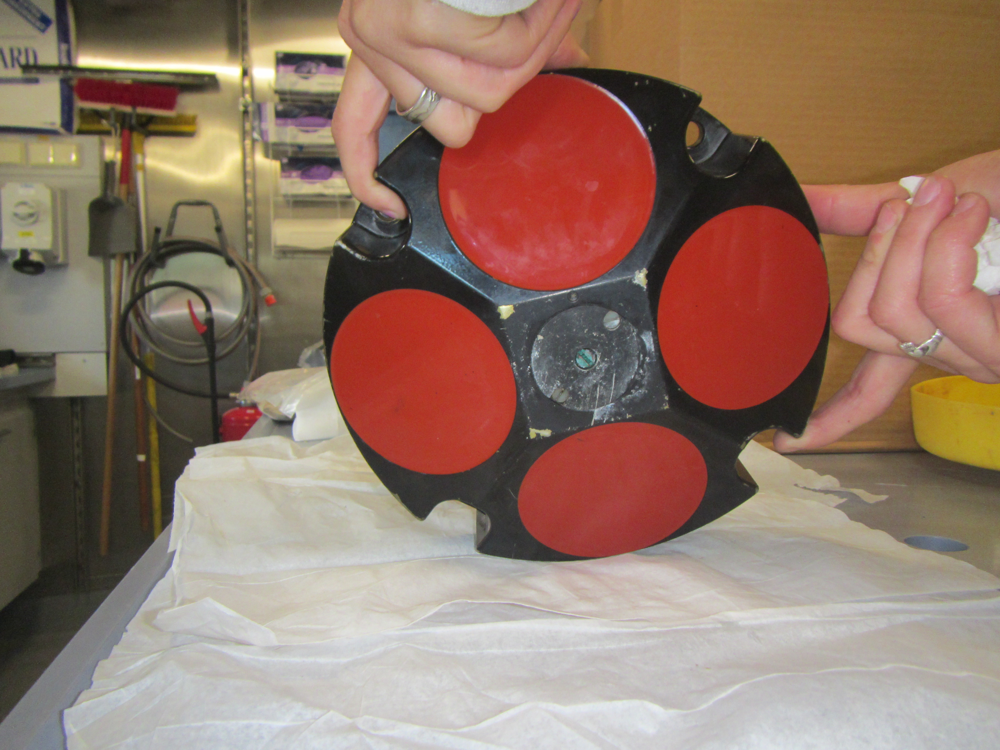
.caption[
Acoustic Doppler Current Profiler
]
]
.pull-right[
- Records current velocity across various ocean depths using sound wave technology.
]
]

.panel[.panel-name[Research vessel]

.pull-left[

.caption[
RV mirabilis
]
]
.pull-right[
- Can be launched from research vessels.
]
]


.panel[.panel-name[Aqua Satellite]

.pull-left[
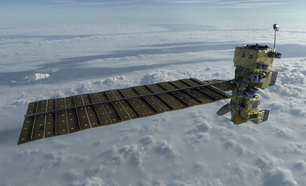
.caption[
NASA's Aqua satellite
]
]
.pull-right[
- The MODIS (Moderate Resolution Imaging Spectroradiometer) sensor is used for earth surface and low atmosphere climatic measurements.
- MODIS was fit to the Aqua and Terra satellites by Santa Barbara Remote sensing in conjunction with NASA in the early 1990s.
]
]

]


???

and mention satellites used to generate the SST and CHL-A images

---


name: mariculture

background-image: url("images/abalone_tanks.png")
background-size: cover

# Mariculture

.itl-orange[
**"Aquaculture" of several marine plant and animal spp.**
]

--

background-image: url("")
background-size: cover


- Nine farms along the coast 
   - e.g., Walvis Bay - Swakopmund, Luderitz and Oranjemund
- 2 MFMR operated, the rest privately owned.
- Production focused on...

---

template: mariculture

background-image: url("")
background-size: cover

.panelset[
.panel[.panel-name[Oyster]

.pull-left[

.caption[
*Crassostrea gigas*
]
]
.pull-right[
- Pacific oyster
- Only organism produced by MFMR.
- Max size 15 - 20 cm
- Exhibit sequential hermaphroditism
   - Can change from male to female and vice versa
]
]


.panel[.panel-name[Abalone]

.pull-left[

.caption[
*Heliotis midae*
]
]
.pull-right[
- Perlemoen
- Max size 12 - 20 cm in length.
- Most valuable culture resource per kg.
- Produced by the hake processing company, Hangana Seafood, in Namibia
]
]


.panel[.panel-name[Seaweed]

.pull-left[
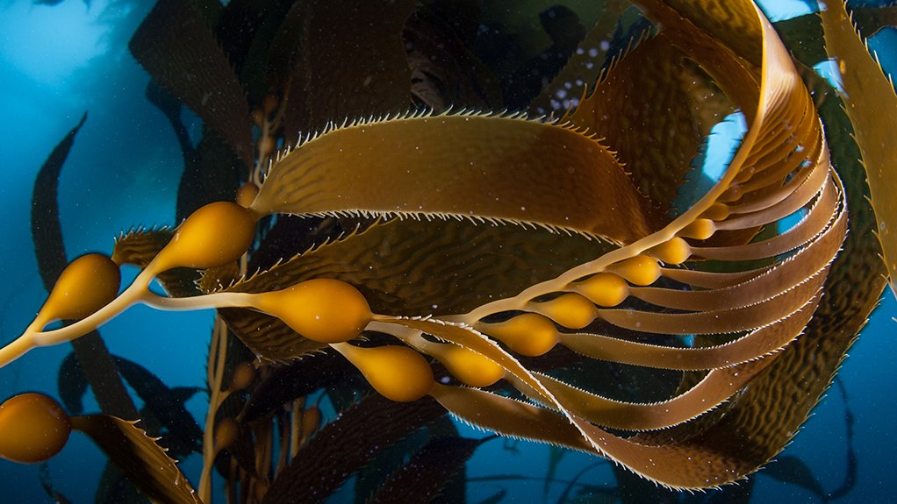
.caption[
*Macrocystis pyrifera*
]
]
.pull-right[
- Giant kelp
- Not a plant, it's a heterokont
   - A group of protists/algae
- Grows to 30m.
- Cultivated by Kelp Blue in Namibia.
- Dominant culture product include = alginate.
   - Ingredient in pharmaceutical and agricultural industry.
]
]
]

???

What is Mariculture
- Specialized branch of aquaculture, involving the cultivation of marine organisms for food and other products.

Oysters
- Change from male to female or vice versa.
- Protandrous 
   - From male to female
- Protogynous
   - From female to male.
- Trait shown in many other aquatic invertebrates

Abalone
- Both its flesh and its shells are sold globally.

Giant kelp
- Also called bladder kelp.
- Attaches to rocks through a structure called a holdfast.
- Protists are organisms that contain a cell nucleus that is not an animal, plant or fungus
- Obtains its nutrients directly from the water and not through roots.

---

template: mariculture

background-image: url("")
background-size: cover

using several .itl-orange[culture techniques] e.g.,


.panelset[
.panel[.panel-name[Long-line]

.pull-left[

.caption[
*C.gigas* culture using long lines
]
]
.pull-right[
- Organisms are fixed to longlines left to hang in the water.
- Longlines hung from main lines connected to "spreader bars" and floats for buoyancy.
- Other example spp include *Mytilus galloprovincialis* and *Ostrea edulis*.

]
]


.panel[.panel-name[Onshore cultivation]

.pull-left[
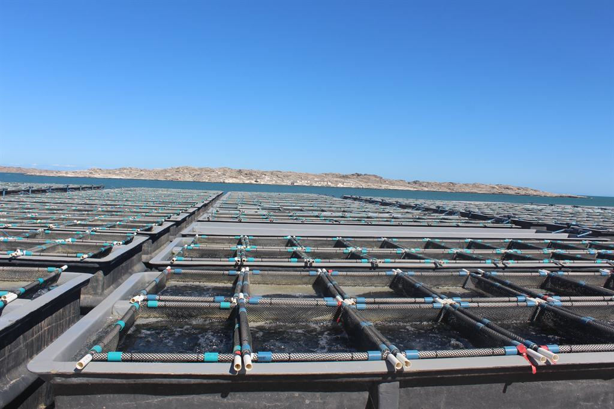
.caption[
Onshore *H.midae* aquaculture facility in Luderitz
]
]
.pull-right[
- Abalone farmed on-shore in tanks.
- Seawater recirculated between the facility and the sea.
- Feed consists mainly of kelp.

]
]
]


---

name: natmirc2

background-image: url("")
background-size: cover

# NatMIRC

.itl-orange[**4 Main sections** - names defined by research area]/.blue[oceanic zone] .itl-orange[research is based in].

.itl-orange[Research objectives] help determine .itl-orange[marine resource management strategies] for Namibian EEZ 


---

# Research Objectives

.itl-orange[**4 Main sections** - names defined by research area]/.blue[oceanic zone] .itl-orange[research is based in].

.itl-orange[Research objectives] help determine .itl-orange[marine resource management strategies] for Namibian EEZ 

.pull-left[
- Pelagic & Demersal
   - .itl-orange[Compilation of reports] on .itl-orange[population level parameters] e.g., spp abundance, size composition, spatial distribution.  
]

--


.pull-right[
- Environment
   - Relating .itl-orange[biological trends] to .itl-orange[oceanographic processes].
]

--

.pull-left[
- Mariculture
   - Alleviate anthropogenic pressure on fisheries sector.
]

???

EEZ
- Exclusive Economic Zone

---

template: natmirc2

In conjunction with information obtained from the .itl-orange[Directorate of Operations], Walvis Bay.

---

name: natmirc2

background-image: url("")
background-size: cover

# NatMIRC & Operations

.itl-orange[**4 Main sections** - names defined by research area]/.blue[oceanic zone] .itl-orange[research is based in].

.itl-orange[Research objectives] help determine .itl-orange[marine resource management strategies] for Namibian EEZ 

In conjunction with information obtained from the .itl-orange[Directorate of Operations], Walvis Bay.


.panelset[
.panel[.panel-name[Patrols]

.pull-left[
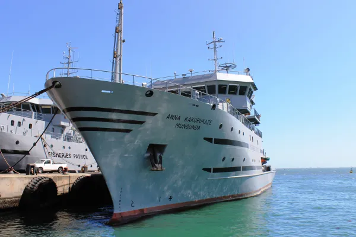
.caption[
Anna Kakurukaze Mungunda patrol vessel
]
]
.pull-right[
- Conduct oceanic surveillance
- Aid with annual surveys
]
]


.panel[.panel-name[Inspectors]

.pull-left[

.caption[
Fisheries inspectors on-board a fishing vessel
]
]
.pull-right[
- Monitor and enforce fisheries legislation at landing sites and on fishing vessels
- Collect accurate landing data 
]
]

.panel[.panel-name[Landings]

.pull-left[
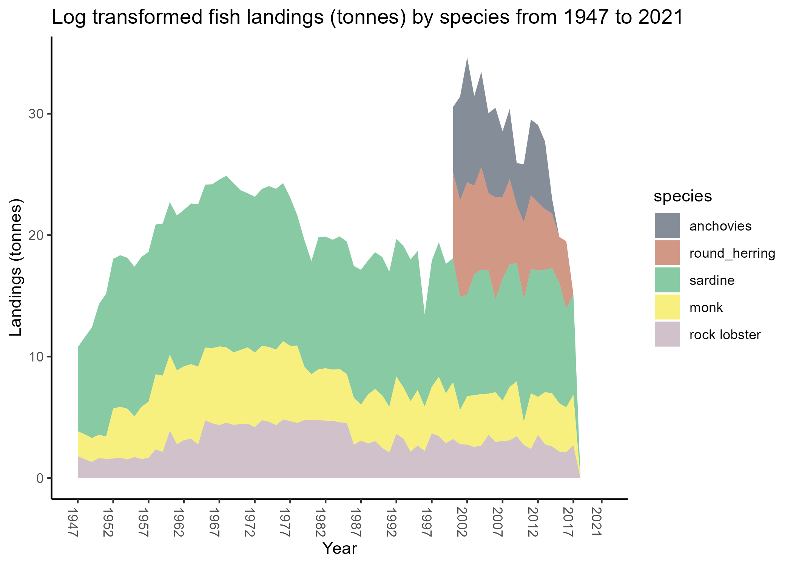
.caption[
Landings data generated by inspectorate
]
]
.pull-right[
- Number of individual fish caught per spp, as counted at ports/landing sites
]
]


]

???

Patrols
- 

---
name: landings

# Landings


```
## PhantomJS not found. You can install it with webshot::install_phantomjs(). If it is installed, please make sure the phantomjs executable can be found via the PATH variable.
```

```
## Error in path.expand(path): invalid 'path' argument
```

---

name: natmirc2

background-image: url("")
background-size: cover

# NatMIRC & Operations

.itl-orange[**4 Main sections** - names defined by research area]/.blue[oceanic zone] .itl-orange[research is based in].

.itl-orange[Research objectives] help determine .itl-orange[marine resource management strategies] for Namibian EEZ 

In conjunction with information obtained from the .itl-orange[Directorate of Operations], Walvis Bay.


.panelset[
.panel[.panel-name[MSY]

.pull-left[
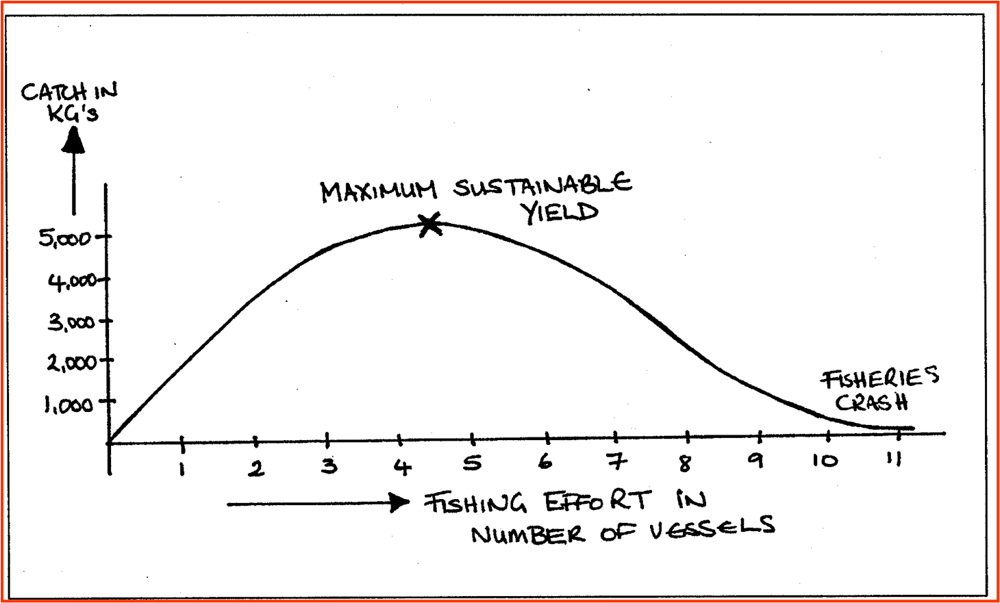
.caption[
Maximum sustainable yield
]
]
.pull-right[
- Highest possible annual catch that can be sustained while attaining stock levels that yield maximum growth
]
]


.panel[.panel-name[TAC]

.pull-left[

.caption[
Total Allowable Catch
]
]
.pull-right[
- Max quantity of fish/spp made available for recreational, subsistence or commercial fishing over predetermined period of time
- Enforced through the allocation and inspection of rights/quotas
]
]


]


---

name: natmirc2

background-image: url("")
background-size: cover

# NatMIRC

.itl-orange[**4 Main sections** - names defined by research area]/.blue[oceanic zone] .itl-orange[research is based in].

.itl-orange[Research objectives] set by the .itl-orange[Marine Resources Act (MRA) 27]

---

name: natmirc2

background-image: url("")
background-size: cover

# MRA 27 of 2000

.itl-orange[**4 Main sections** - names defined by research area]/.blue[oceanic zone] .itl-orange[research is based in].

.itl-orange[Research objectives] set by the .itl-orange[Marine Resources Act (MRA) 27]


- Principal MFMR governing regulations defined in 2000  

--


- Guidelines for marine resource conservation efforts
   - e.g., how and when to issue permits/quotas
   - Measures required to enforce resource use regulation

---

template: natmirc

background-image: url("")
background-position: bottom
background-size: contain


## Benguela current

All four heavily influenced by the .itl-orange[Benguela current]


---

name: benguela

# Benguela current

.panelset[
.panel[.panel-name[EBUS]

.left-column[
- 1 of 4 .itl-orange[Eastern Boundary Upwelling Systems]
]
.right-column[

]
]

.panel[.panel-name[Upwelling]

.left-column[
- Warm surface waters replaced by cool, nutrient rich bottom waters
]
.right-column[

]
]


.panel[.panel-name[Productive]

.left-column[
- Increase in primary productivity
- Subsequent increase in marine fauna abundances
]
.right-column[

]
]


]

---


